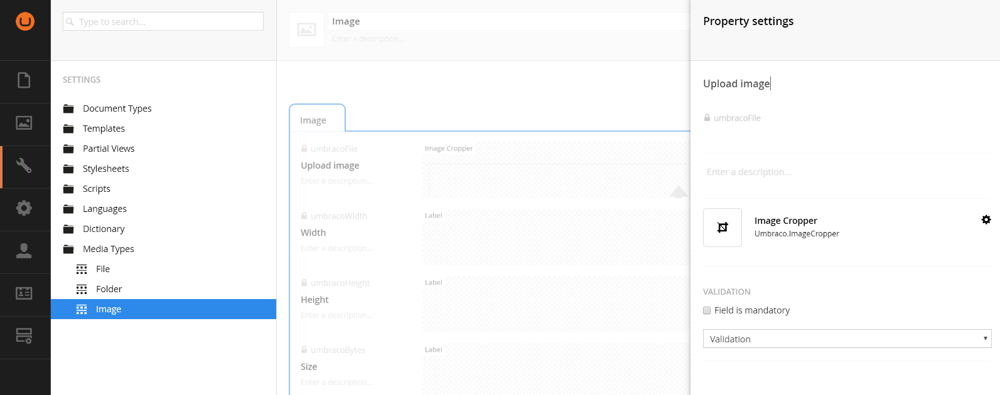
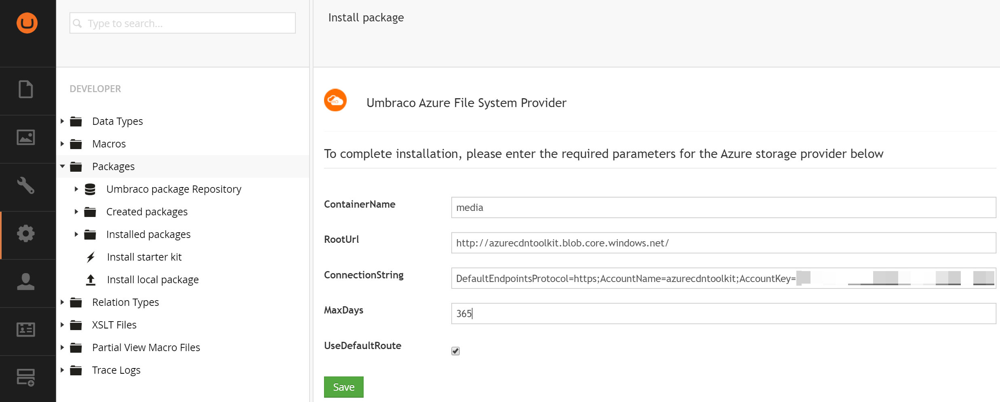
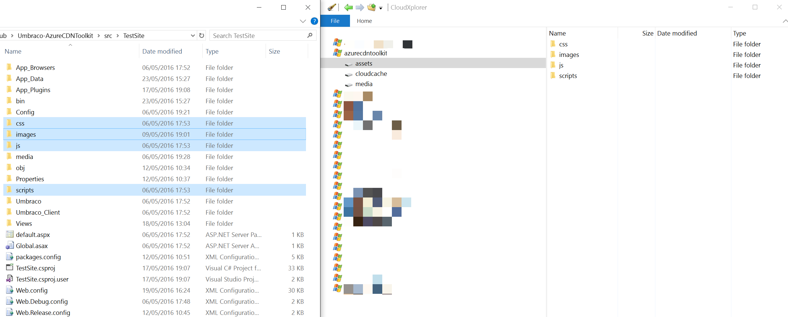

# Umbraco Setup #

## Prerequisites ##

You will need to have a Visual Studio Web Application project with Umbraco v7.3.8 or above installed.

Ensure your content managed image type media items are using a Image Cropper for the `umbracoFile` property (this is default in Umbraco v7.4+)

## 1. ImageProcessor.Web.Config ##

Install this package via NuGet, it will add three configuration files to your solution.

NuGet Package:

	Install-Package ImageProcessor.Web.Config  

## 2. UmbracoFileSystemProviders.Azure ##

Use v0.5.2-beta or above

Install the UmbracoFileSystemProviders.Azure package. Recommended that you first install using the Umbraco package and then install the NuGet package over the top, configuration will be maintained, this is to take advantage of the Umbraco installer configuring everything needed automatically.

[Download Umbraco package](https://our.umbraco.org/projects/collaboration/umbracofilesystemprovidersazure/)

NuGet Package:

	Install-Package UmbracoFileSystemProviders.Azure -Pre  

When running the configuration in the Umbraco installer be sure to use the key and account name from [Step 2 of the Azure Setup.](Azure-Setup.md)
    

**Note:** Be sure to leave the "UseDefaultRoute" checked

## 3. ImageProcessor.Web.Plugins.AzureBlobCache

Install this package via NuGet

NuGet Package:

    Install-Package ImageProcessor.Web.Plugins.AzureBlobCache

Once installed you will need to edit /Config/imageprocessor/cache.config

It should look like this:

	  <caching currentCache="DiskCache">
	    <caches>
	      <cache name="DiskCache" type="ImageProcessor.Web.Caching.DiskCache, ImageProcessor.Web" maxDays="365">
	        <settings>
	          <setting key="VirtualCachePath" value="~/app_data/cache" />
	        </settings>
	      </cache>
	      <cache name="AzureBlobCache" type="ImageProcessor.Web.Plugins.AzureBlobCache.AzureBlobCache, ImageProcessor.Web.Plugins.AzureBlobCache" maxDays="365">
	        <settings>
	          <setting key="CachedStorageAccount" value="DefaultEndpointsProtocol=https;AccountName=[CacheAccountName];AccountKey=[CacheAccountKey]"/>
	          <setting key="CachedBlobContainer" value="cache"/>
	          <setting key="UseCachedContainerInUrl" value="true"/>
	          <setting key="CachedCDNRoot" value="[CdnRootUrl]"/>
	          <setting key="CachedCDNTimeout" value="1000" />
	          <setting key="SourceStorageAccount" value=""/>
	          <setting key="SourceBlobContainer" value=""/>
	          <setting key="StreamCachedImage" value="false"/>
	        </settings>
	      </cache>
	    </caches>
	  </caching>

In the AzureBlobCache section you need to update the following keys:

1. CachedStorageAccount set to the key and account name from [Step 2 of the Azure Setup](Azure-Setup.md).
2. CachedBlobContainer change this if you want to (e.g. cloudcache), it will be included in the path of cropped images.
3. CachedCDNRoot set to the name of your CDN endpoint from [Step 5 of the Azure Setup](Azure-Setup.md).
4. It's recommended you change the CachedCDNTimeout to 2000

Now change:

	<caching currentCache="DiskCache">

To

	<caching currentCache="AzureBlobCache">

This will enable ImageProcessor.Web to store it's cache files in your storage account container.

## 4. Our.Umbraco.AzureCDNToolkit ##

NuGet Package:

    Install-Package Our.Umbraco.AzureCDNToolkit -Pre

Once installed you will find 6 new keys in web.config

The `UseAzureCdnToolkit` turns CDN Toolkit on or off, generally when developing on a local machine you will want this set to false so you can easily update assets but set to true on stage/live servers. This setting doesn't have any effect on enabling disabling the dependant packages.

    <add key="AzureCDNToolkit:UseAzureCdnToolkit" value="true" />

The `Domain` key has to be set the url of the website being served from Umbraco. This url must be resolvable by the server itself, so watch out for servers that don't have dns loopback. If load balancing it doesn't matter if this url resolves from one server to another.

    <add key="AzureCDNToolkit:Domain" value="http://[www.myumbracowebsite.com]" />

The `CdnUrl` set to the name of your CDN endpoint from [Step 5 of the Azure Setup](Azure-Setup.md).

    <add key="AzureCDNToolkit:CdnUrl" value="https://[azurecdntoolkit].azureedge.net" />

The `CdnPackageVersion` is used to cache bust assets on your CDN

    <add key="AzureCDNToolkit:CdnPackageVersion" value="0.0.1" />

The `AssetsContainer` allows a different name for your assets container if you wish to (e.g. you may have multiple sites in the same account)

    <add key="AzureCDNToolkit:AssetsContainer" value="assets" />

The `MediaContainer` allows a different name for your media container if you wish to (e.g. you may have multiple sites in the same account)

    <add key="AzureCDNToolkit:MediaContainer" value="media" />

When `SecurityModeEnabled` is enabled, the CDN toolkit will lock down ImageProcessor so that it will not process requests made directly via querystrings in the URL. This is to prevent any sort of ddos attack which could otherwise flood the CDN. This setting was added in **v0.2.0-beta**

    <add key="AzureCDNToolkit:SecurityModeEnabled" value="true" />

The value of this key must be valid in a querystring. e.g "unicornsrock123456789". Please be aware that all requests to ImageProcessor must be executed through the methods of this toolkit when this setting is enabled. This setting was added in **v0.2.0-beta**

    <add key="AzureCDNToolkit:SecurityToken" value="unicornsrock123456789" />

## 5. Upload assets to the "assets" container ##

Upload your static assets to the container created in [Step 7 of the Azure Setup](Azure-Setup.md).

## 6. Check everything works ##

Before proceeding to [implementing](Umbraco-Implementation.md) the AzureCDNToolkit it's worth checking that the installed packages are working correctly and Azure is setup and ready. 

Checklist:

- Check images load on the front end and in the Umbraco media section in a cropper
- Check file media downloads ok

If you get 404 errors on the front end, it's likely that your CDN endpoint hasn't had long enough to setup.